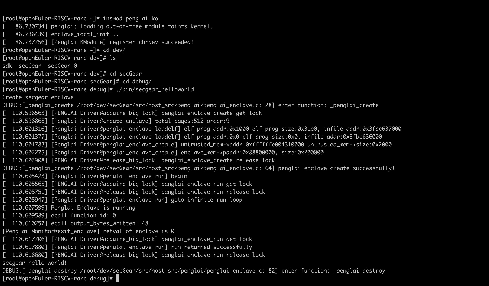
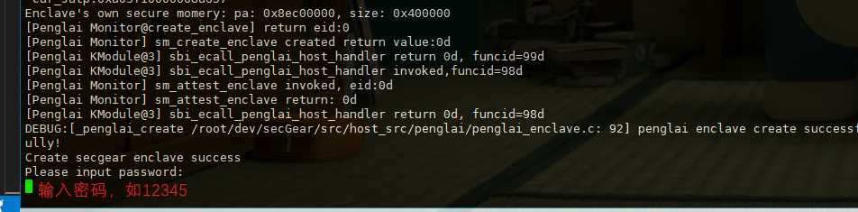
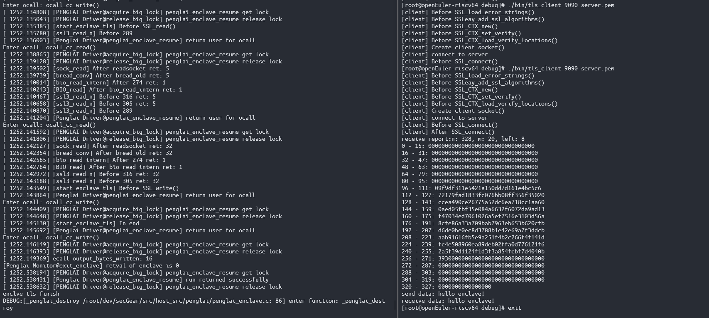

## secGear for RISC-V TEE

目前secGear支持基于蓬莱TEE的RISC-V可信执行环境

### Helloworld Demo
下面说明如何运行helloworld demo


#### 1. 准备openEuler RISC-V环境

相关openEuler RISC-V镜像(如  [openEuler-23.03](https://mirror.iscas.ac.cn/openeuler-sig-riscv/openEuler-RISC-V/preview/openEuler-23.03-V1-riscv64/QEMU/))以及支持的最新的蓬莱[monitor](https://github.com/penglai-enclave/penglai-enclave-sPMP)、[penglai SDk](https://github.com/Penglai-Enclave/penglai-sdk)。

在RISC-V下编译secGear需要Ocaml、penglai_ssl等依赖环境。
目前我们已经准备预编译的Ocaml包来简化这个过程，用户可以直接从
[opam.tar.gz](https://ipads.se.sjtu.edu.cn:1313/f/fcab1b0b8f864436b765/)、[sdk](https://ipads.se.sjtu.edu.cn:1313/f/96aa0496d47441d6824d/)、[penglai-ssl-1.0-1.riscv64.rpm](https://ipads.se.sjtu.edu.cn:1313/f/572eaef2fef5416eba96/)
下载下面说明文档指令中所需的包。

```
#penglai_secGear_env-v1.0.tar.g中包含sdk、secGear、opam、penglai.ko等预编译内容
wget https://ipads.se.sjtu.edu.cn:1313/f/717d7a03848c46d380d1/?dl=1 -O penglai_secGear_env-v1.0.zip
unzip penglai_secGear_env-v1.0.zip
```

#### 2. 配置环境

启动一个RISC-V openEuler环境。

拷贝二进制和设置环境变量：

1) 将opam（ocaml包管理器）软件压缩包从主机复制到RISCV qemu：
```
scp -P 12055 -r ./penglai_secGear_env-v1.0/opam.tar.gz root@localhost:~/
```

2) 在虚拟机根目录（～/）下解压（该路径于secGear/environment中环境变量指定路径相关，不建议修改）

```shell
tar -zxvf opam.tar.gz
```

3) 安装cmake和openssl

```
yum install cmake dune openssl dune openssl-devel -y
```

#### 3. 编译 secGear 项目

1. 在虚拟机中根目录（～/）下创建dev文件夹、
```shell
mkdir ~/dev
```

2. 拷贝secGear到dev文件夹：
```shell
scp -P 12055 -r secGear root@localhost:~/dev
```

3. 拷贝蓬莱sdk到dev文件夹（该路径与下文cmake编译时指定的蓬莱sdk路径参数、CMakeLists中PL_SDK_DEFAULT_PATH指定路径相关，不建议修改）

```
scp -P 12055 -r ./penglai_secGear_env-v1.0/sdk root@localhost:~/dev
```

4. 进入secGear目录，创建debug目录并在其中编译：

```shell
cd ~/dev/secGear
source environment && mkdir -p debug && cd debug
cmake -DENCLAVE=PL .. && make && make install
```

#### 4. 运行 helloworld 程序

拷贝penglai.ko到虚拟机主目录：

```shell
scp -P 12055 ./penglai_secGear_env-v1.0/penglai.ko root@localhost:~/
```

此时虚拟机debug目录的bin目录下已经有secgear_helloworld等可执行文件，**安装蓬莱驱动后**，可在此目录下运行程序：

```shell
#安装蓬莱驱动
insmod ~/penglai.ko
cd ~/dev/secGear/debug
./bin/secgear_helloworld
```


运行结果
---------


### Run other demo

检查`secGear/examples/CMakeLists.txt`中的tls_demo对应部分编译模块是否启用,启用后编译完成会在编译目录`./secGear/debug/bin`下生成两个程序secgear_tls作为server，tls_client作为client
```CMakeLists.txt
	if(CC_PL)
	add_custom_command(TARGET copy
		POST_BUILD
		COMMAND cp ${LOCAL_ROOT_PATH}/inc/host_inc/penglai/*.h ${CMAKE_BINARY_DIR}/inc/secGear/
		COMMAND cp ${LOCAL_ROOT_PATH}/inc/host_inc/penglai/*.edl ${CMAKE_BINARY_DIR}/inc/secGear/
		COMMAND cp ${LOCAL_ROOT_PATH}/inc/enclave_inc/penglai/*.h ${CMAKE_BINARY_DIR}/inc/secGear/)
	add_subdirectory(seal_data)
	add_subdirectory(helloworld)
	add_subdirectory(helloworld_with_ocall)
	add_subdirectory(calcu_enclave)
	add_subdirectory(tls_enclave)
	#add_subdirectory(lrt)
	endif()
```

启用对应demo 模块后，下载安装penglai-openssl相关库([rpm包下载链接](https://ipads.se.sjtu.edu.cn:1313/f/572eaef2fef5416eba96/))：


1. 由主机拷贝至虚拟机：
```
scp -P 12055 ./penglai_secGear_env-v1.0/penglai-ssl-1.0-1.riscv64.rpm root@localhost:~/
rpm -ivh ~/penglai-ssl-1.0-1.riscv64.rpm
```
2. 或者在虚拟机内下载安装：
```
wget https://ipads.se.sjtu.edu.cn:1313/f/572eaef2fef5416eba96/?dl=1 -O ~/penglai-ssl-1.0-1.riscv64.rpm
rpm -ivh ~/penglai-ssl-1.0-1.riscv64.rpm
```

进入编译目录`secGear/debug`，执行下述指令：

```shell
cd ./secGear/debug
cmake -DENABLE_ENC_KEY=1  -DCMAKE_BUILD_TYPE=Debug -DENCLAVE=PL -DSDK_PATH=/root/dev/sdk -DSSL_PATH=/opt/penglai/openssl .. && make && make install
```

编译成功后，demo程序位于`./secGear/debug/bin`目录下，包含secgear_tls和tls_client。

### 运行tls_demo注意事项

本地使用可以使用openssl生成加密秘钥和自签名证书,
```shell
cd ~/dev/secGear/debug
#执行生成秘钥指令时需要设置密码
#当前示例代码中秘钥密码编码为: 12345
openssl genpkey -algorithm RSA -aes256 -out server.key
#生成证书请求文件
openssl req -new -key server.key -out server.csr
#生成自签名证书
openssl x509 -req -in server.csr -signkey server.key -out server.pem
```

debug目录下运行demo
```shell
#两个终端分别执行
./bin/secgear_tls 9090 server.pem server.key
./bin/tls_client 9090 server.pem
```
**注意：** 在第一次执行`./bin/secgear_tls`指令生成enc_key文件时，由于需要读取秘钥文件server.key，因此执行过程需要输入秘钥密码（上步中密码：12345）。



在第一次执行后会得到一个由Enclave加密生成的enc_key文件用于后续加密通信，由于当前Enclave创建使用一次退出后会销毁，第一次编译程序用于生成enc_key，查看当前debug目录下存在server.key、server.csr、server.pem、enc_key即执行成功。


执行结束后需要重新在当前debug目录执行编译指令（由上一条ENABLE_ENC_KEY=1改为ENABLE_ENC_KEY=0） :
```shell
cmake -DENABLE_ENC_KEY=0 -DCMAKE_BUILD_TYPE=Debug -DENCLAVE=PL -DSDK_PATH=/root/dev/sdk -DSSL_PATH=/opt/penglai/openssl .. && make -j$(nproc) && make install
```

重新执行client和server程序
```shell
#两个终端分别执行
./bin/secgear_tls 9090 server.pem server.key
./bin/tls_client 9090 server.pem
```
成功执行后，会在client端收到server发送的Enclave report(不同Enclave生成report不同)和发送的消息"hello enclave!".

```
receive report:n: 328, m: 20, left: 8
0 - 15: 00000000000000000000000000000000
16 - 31: 00000000000000000000000000000000
32 - 47: 00000000000000000000000000000000
48 - 63: 00000000000000000000000000000000
64 - 79: 00000000000000000000000000000000
80 - 95: 00000000000000000000000000000000
96 - 111: 09f9df311e5421a150dd7d161e4bc5c6
112 - 127: 72179fad1833fc076bb08ff356f35020
128 - 143: ccea490ce26775a52dc6ea718cc1aa60
144 - 159: 0aed05fbf35e084a6632f6072da9ad13
160 - 175: f47034ed7061026a5ef7516e3103d56a
176 - 191: 8cfe86a33a709bab7963eb653b620cfb
192 - 207: d6de0be0ec8d3788b1e42e69a7f3ddcb
208 - 223: aab91616fb5e9a251f4b2c266f4f141d
224 - 239: fc4e508960ea89deb02ffa0d776121f6
240 - 255: 2a5f39d1124f1d3f3a854fcbf7d4040b
256 - 271: 39300000000000000000000000000000
272 - 287: 00000000000000000000000000000000
288 - 303: 00000000000000000000000000000000
304 - 319: 00000000000000000000000000000000
320 - 327: 0000000000000000
send data: hello enclave!
receive data: hello enclave!
```

